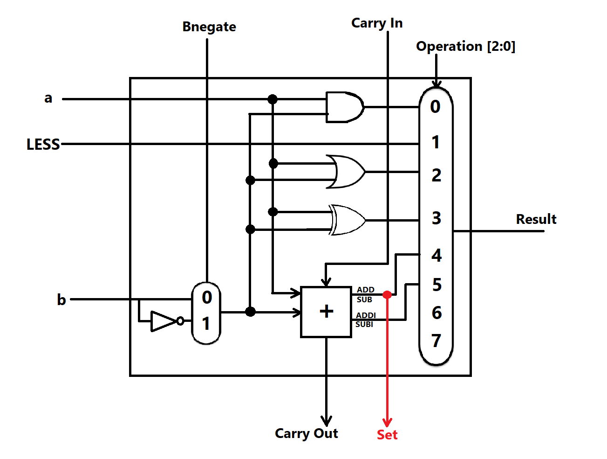
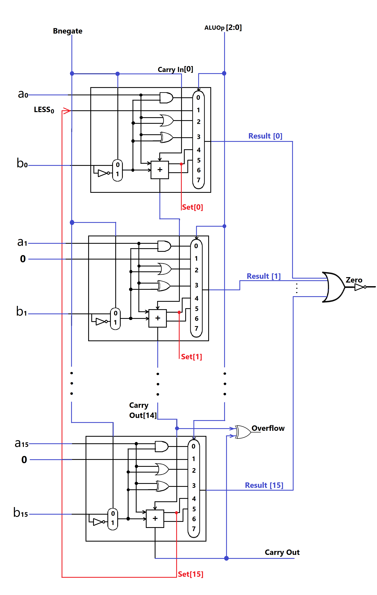
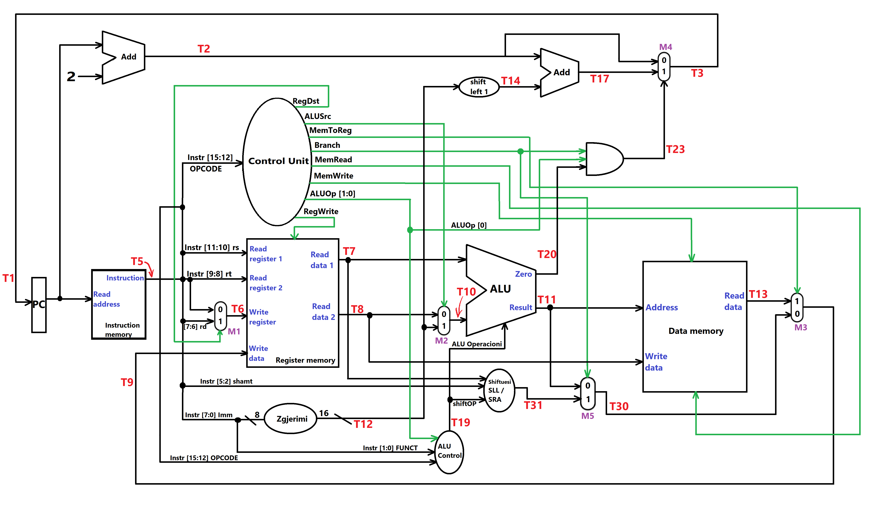
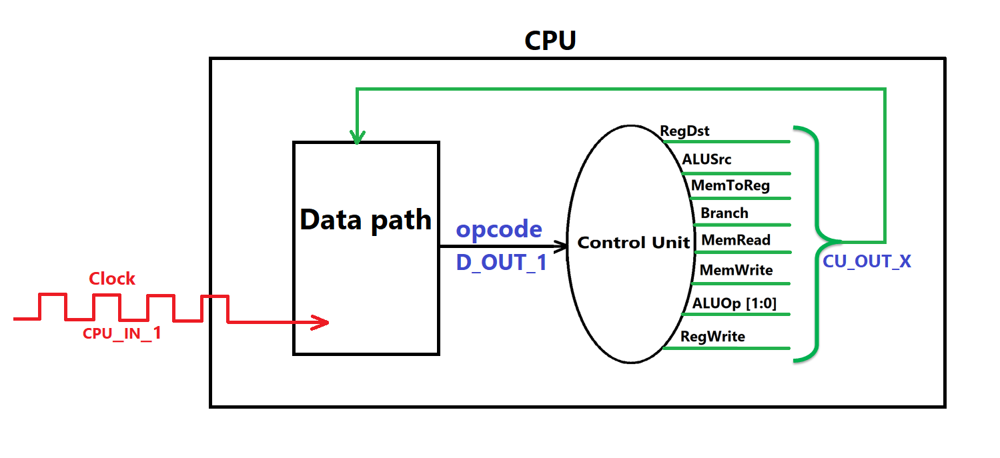

<p align="center">
  <a>
    
  </a>

<h2 align="center">University of Prishtina : Faculty of Electrical and Computer Engineering</h2>
<h3 align="center">Course: Computer Architecture</h3>
<h2 align="center">Project: Single Cycle CPU 16 bit with Verilog</h2>
<p align="left">Professor: Valon Raça</p>
<p align="left">Assistant: Synim Selimi</p>

<p align="left">Student: Edon Gashi</p>


## Project summary

This project requires the implementation of a 16-bit CPU, operating on the single-cycle principle, and the CPU architecture is inspired by the MIPS instruction set. This CPU is implemented in Verilog and should interact with various memory units through which writing, reading, and processing of data in memory elements is achieved. By utilizing several other components that enable shifting, combining, and logical operations between numbers, the execution of instructions such as AND, SLTI, OR, XOR, ADD, ADDI, SUB, SUBI, SLL, SRA, LW, SW, and BEQ is accomplished. The CPU includes:

 - `Register File`: 4 general-purpose registers for storing data.
 - `Data Memory`: A small memory module to store data for computation.
 - `Instruction Memory`: A memory module for fetching instructions.

The CPU executes instructions in a single clock cycle, making it a simple yet effective platform to study CPU design and MIPS-based instruction execution.

<br>

 
 
## Modules

  - ### ALU 1 bit module

  
One of the main modules that performs a large number of logical and algebraic operations is the ALU. In this task, it is required to support instructions such as AND, SLTI, OR, XOR, ADD, and SUB.


Inside the ALU, there are components such as AND, OR, XOR, and  `Mbledhës1bit` (english: 1bitAdder). Inputs A and B are connected to each of these components, except that B passes through an inverter and a multiplexer, which, depending on the input signal Bnegate, outputs either the value of B (for 0) or the inverted value of B (for 1). The outputs of all these internal components are connected to an 8-to-1 multiplexer.
<br>
<p align="center"> ALU 1 bit diagram and functions
  <br>
<a>
    
  </a>
  </p>
<br><br>

  - ### ALU 16 bit module

  The 16-bit ALU is implemented as a sequential connection of 1-bit ALUs. The CarryIn of the first 1-bit ALU instance is directly connected to Bnegate. This is because, for all operations involving the LSB bit and addition, the CarryIn must always be zero. However, for subtraction operations, in addition to inverting B, the LSB must be incremented by 1 to convert it to 2's complement. In conclusion, since Bnegate takes the value 1 only during subtraction, this connection is convenient to achieve the desired functionality.
  <br>
<p align="center"> ALU 16 bit diagram and functions
  <br>
<a>
    
  </a>
  </p>
<br><br>

  - ### Control Unit module

  
Knowing that the hardware is parallel, active all the time, and considering the fact that depending on the operation that the CPU needs to perform, not all of its components will be active, some of its components in certain cases must necessarily be "turned off". This can only be achieved if we perform a certain action, which is why there was a need to implement a component that holds the responsibility for this, and that is the control unit. This component has as input the opcode of the instruction and multiple outputs. The outputs are distributed almost to all other components of the CPU, depending on the input value that identifies the nature of a particular instruction, ensuring that the other components are directed accordingly. More specifically, the goal is that depending on the instruction, the components needed by that instruction will be activated, and the path for the data to travel will be determined.

<br><br>


  - ### ALU Control module

The control unit was the one that, based on a specific instruction, determined the path where the data would go and directly instructed the other components on what to do, except for the ALU, which it does not control directly. However, it sends 2 ALUOp bits, which, together with 2 bits from the funct field of the instruction, enter another unit called ALUControl. The ALUControl unit then outputs 4 bits, which go directly to the ALU. Depending on these 4 bits, the ALU knows what instruction is being referenced (the last three bits represent the operation, which determines what the 8-to-1 multiplexer will output), and it is directed on how to behave (the first bit determines the inversion of operand B).

However, in our case, there are instructions for which the control unit sends the same `ALUOp`, even though the `funct` bits are the same. In this case, to inform the ALU about which instruction is being referenced, in addition to funct and ALUOp, we also check the opcode, even though it was already checked once in the control unit.

Therefore, ALUControl was created exclusively to control the ALU based on the incoming instruction, but in our case, its output will also be used to control the component that performs the shift instructions SLL and SRA.
<br><br>
<p align="center"> The signals of the control units for each instruction
  </p>
  

| OPCODE        | Funct            | Bnegate        | Bit1    | Bit2 | Bit3 | OPERATION  | RegDst | ALU Src | Mem toReg | Reg Write | Mem Read | Mem Write | ALU Op | Branch |
|---------------|------------------|----------------|---------|------|------|------------|--------|---------|-----------|-----------|----------|-----------|--------|--------|
| 0000          | 00               | 0              | 0       | 0    | 0    | AND        | 1      | 0       | 0         | 1         | 0        | 0         | 10     | 0      |
| 1011          | xx               | 0              | 0       | 0    | 1    | SLTI       | 0      | 1       | 0         | 1         | 0        | 0         | 11     | 0      |
| 0000          | 01               | 0              | 0       | 1    | 0    | OR         | 1      | 0       | 0         | 1         | 0        | 0         | 10     | 0      |
| 0000          | 10               | 0              | 0       | 1    | 1    | XOR        | 1      | 0       | 0         | 1         | 0        | 0         | 10     | 0      |
| 0001/0001     | 00/01            | 0/1            | 0       | 0    | 0    | ADD/SUB    | 1/1    | 0/0     | 0/0       | 1/1       | 0/0      | 0/0       | 10/10  | 0/0    |
| 1001/1010     | xx               | 0/1            | 0       | 0    | 0    | ADDI/SUBI  | 0/0    | 1/1     | 0/0       | 1/1       | 0/0      | 0/0       | 11/11  | 0/0    |
| 0010          | 00               | 0              | 1       | 0    | 0    | SLL        | 1      | x       | 0         | 1         | 0        | 0         | 10     | 1      |
| 0010          | 01               | 0              | 1       | 0    | 1    | SRA        | 1      | x       | 0         | 1         | 0        | 0         | 10     | 1      |
| 1100          | xx               | 0              | 1       | 0    | 0    | LW         | 0      | 1       | 1         | 1         | 1        | 0         | 00     | 0      |
| 1101          | xx               | 0              | 1       | 0    | 0    | SW         | x      | 1       | 0         | 0         | 0        | 1         | 00     | 0      |
| 1111          | xx               | 1              | 1       | 0    | 0    | BEQ        | 0      | 0       | 0         | 0         | 0        | 0         | 01     | 1      |

<br>
<br>


  - ### Control Unit module
  
Instructions are nothing more than words translated into 16 bits. Since a certain program has a large number of instructions and these instructions need to be read by the CPU, it is necessary for these instructions to be stored in a memory called instruction memory. In this memory, the instructions are stored, and each one is read one by one. Since our instructions are 16 bits (2 bytes) each, this means that each instruction occupies 2 memory addresses, so the reading process must be done every 2 addresses.

There is a register called the PC (program counter), which is responsible for storing the address of the next instruction we are reading. This address is taken as input by the instruction memory, and the instruction located at that address is provided as output. During the execution of instructions, the value of the PC must be continuously updated. More specifically, it must increase by 2 after each instruction, except in cases where the BEQ condition is met, which directs the PC to increase or decrease its address by a certain value (for both cases, the adders take care of returning the next calculated PC value back to the PC at every clock cycle).

In our case, this instruction memory is 128 bytes, and the first 10 addresses are reserved. Therefore, the instructions will be written starting from address 11 onward. In principle, this memory takes a certain address from the PC as input, reads the instruction located at that address, and outputs it.

<br><br>


  - ### Register Memory
  
Most of the instructions after performing the operation return the result to a certain register (except for the SW instruction, which is specialized for storing in memory). On the other hand, there is a constant need for reading values from those registers that will enter the operation. For this reason, it was deemed necessary to implement another component that contains these registers, which is capable of writing to and reading from these registers. This component is called register memory.

This memory will have inputs that specify which register to read from, which register to write to, what to write in that register, when to write, and the output should be the values of the registers that are read.

In our case, this memory contains 4 registers: $zero (which always has a value of zero) and 3 other registers that we use for various operations: $r1, $r2, $r3.

|Register name|Register address|
|-------------|----------------|
|$zero        |00              |
|$r1          |01              |
|$r2          |10              |
|$r3          |11              |

It is worth emphasizing that at the beginning of any execution, the initial values of the registers are zero. This will be implemented in the data path.
<br><br>

 - ### Data Memory
  
Registers are a very good solution for storing data where fast access (reading and writing) is required, due to their proximity to the ALU. On the other hand, it is not efficient to increase the number of registers because the data access time increases, and they lose their purpose for which they exist. Therefore, to store large amounts of data, it is necessary to implement a memory with much higher capacity. For this reason, data memory has been created, which is similar to instruction memory, has a capacity of 128 Bytes, and each Byte has a specific address that can be accessed in order to write and read data.
<br><br>

 - ### Data Path module

Once all these components are implemented and tested, it is time for them to communicate with each other by exchanging data and being directed by the control units. To achieve this, it is necessary to lay out the path or route through which the data and control signals will travel. The collection of these paths through which the data passes, as well as the connection of these components with each other, is called the data path. And within it, the wiring (wires) between the components will be established, as well as the instantiation of all components, except for the control unit. In our data path, each wire is named in code, which corresponds to the wire names in the schematic.
<br><br>
<p align="center"> Data path diagram
  <br>
<a>
    
  </a>
  </p>
<br><br>

 - ### CPU module

Finally, we have reached the point where we will have a module that contains all the components we have implemented so far, and its only input is the clock. This is the CPU itself. Inside it, we will instantiate the data path and the control unit. But first, a brief clarification on how its implementation is done. Everything except for the control unit is the data path. The data path takes as input all the outputs from the control unit, while the output of the data path, which is the opcode, will serve as input for the control unit. This connection between the control unit and the data path, when they are instantiated in a module called the CPU and the only input sent to them is the clock, makes our CPU function, starting with the reading of instructions in the instruction memory...
<br><br>
<p align="center"> CPU diagram
  <br>
<a>
    
  </a>
  </p>
<br><br>


- Clone this project:
   ```bash
   git clone https://github.com/EdonFGashi/CPU_16bit_Single_Cycle_with_Verilog.git
<br><br>
   <a href="#top">Return in the top of page ↑</a>
